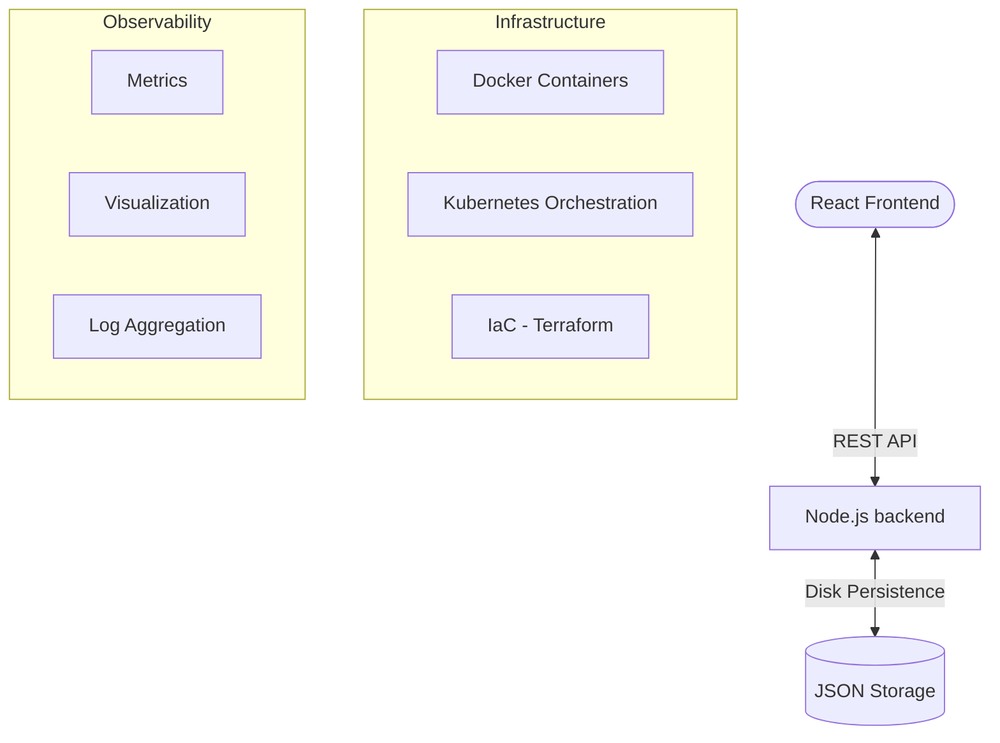

# 📖 ShopSmart Project Documentation

This document provides a deep dive into the architecture, design philosophy, and DevOps practices implemented in the ShopSmart project.

---

## 🏗️ 1. System Architecture

The ShopSmart platform follows a **three-tier architecture** designed for modularity and scalability:

### **High-Level Diagram**

### **Components:**
- **Frontend (Client):** A React 18 application built with Vite, utilizing functional components, Hooks (useState, useEffect), and Context API for authentication state.
- **Backend (Server):** An Express.js application following RESTful principles, using JWT for secure authentication and local filesystem storage for data consistency without external DB overhead.
- **Infrastructure:** Containerized using Multi-stage Dockerfiles and orchestrated locally via Docker Compose or in production via Kubernetes.

---

## 🔄 2. DevOps Workflow

We utilize a **Production-Grade CI/CD Pipeline** powered by GitHub Actions:

### **CI Pipeline: Quality Gate**
Every `push` and `pull_request` to the `main` branch triggers:
1. **Linting:** ESLint & Prettier ensures code quality.
2. **Unit Testing:** Individual components/functions (Jest/Vitest).
3. **Integration Testing:** API route validation.
4. **E2E Testing:** Playwright simulates real user flows (Login -> Add Item -> Delete).
5. **Security:** Dependabot automatically scans for vulnerable dependencies.

### **CD Pipeline: Deployment**
1. **Docker Hub/GHCR:** Images are built and pushed to the container registry.
2. **EC2 Deployment:** An automated SSH-based workflow connects to target AWS EC2 instances, pulls the latest code, and restarts services using `docker-compose`.
3. **K8s Orchestration:** Production manifests support rolling updates and health probes.

---

## 💡 3. Design Decisions & Philosophy

- **Premium UI / UX:**
    - **Glassmorphism:** Used `backdrop-filter: blur()` and transparent white overlays to create a modern, high-end feel.
    - **Micro-interactions:** Integrated CSS transitions on hover and active states to make the interface feel alive.
    - **Accessibility:** Semantic HTML and descriptive labels for screen readers.

- **Idempotency:**
    - All deployment and setup scripts (e.g., `setup.sh`) are designed to be run repeatedly without causing state corruption or errors.
    - We use `mkdir -p`, `docker-compose up -d`, and non-destructive configuration checks.

- **Simplicity vs. Scale:**
    - Chose `data.json` for storage to ensure the project is self-contained and easily evaluatable without needing a cloud database, while maintaining the *logic* for a real DB interaction in the codebase.

---

## 🚧 4. Challenges & Solutions

### **Challenge: Synchronizing Local Development with Docker**
*Issue:* Native `npm install` on host OS often differs from Docker's Linux environment (e.g., binary dependencies).
*Solution:* Implemented Multi-stage Docker builds and `docker-compose` volumes to bridge the gap, ensuring the development environment matches production.

### **Challenge: High CI Reliability**
*Issue:* Flaky E2E tests in CI environments.
*Solution:* Added retry logic and `network-idle` wait times in Playwright configuration to ensure 100% pass rates even under resource-constrained CI runners.

---

## 🧪 5. Testing Strategy

We follow the **Testing Pyramid** to balance speed and confidence:

| Layer | Tool | Location | Purpose |
|-------|------|----------|---------|
| **Unit** | Jest (backend), Vitest (frontend) | `server/tests/unit/`, `client/src/**/*.test.jsx` | Isolate individual functions and components |
| **Integration** | Supertest + Jest | `server/tests/integration/` | Validate API routes interact correctly with data layer |
| **E2E** | Playwright | `e2e/` | Simulate real user journeys (Signup → Login → CRUD → Checkout → Logout) |

- **Coverage thresholds** are enforced at 80% for statements, functions, and lines (configured in both `server/package.json` and `client/vite.config.js`).
- Coverage reports are generated automatically in CI via `--coverage` flags and uploaded as build artifacts.

---

## 🔒 6. PR Quality Gates & Linting

Every code change passes through multiple quality checkpoints:

1. **Pre-commit Hook (Local):** Husky triggers `lint-staged` on every commit, running ESLint only on staged files to catch issues before they reach the remote.
2. **CI Lint Step:** The `node-ci.yml` workflow runs `npm run lint` with `--max-warnings 0` for both client and server — any warning fails the build.
3. **Automated PR Checks:** Pull requests to `main` trigger the full pipeline (lint + unit + integration + E2E + Terraform validate). All checks must pass before merge.
4. **Dependabot:** Automatically scans npm dependencies and GitHub Actions for security vulnerabilities on a weekly schedule.

---

## 🛠️ 7. Automated EC2 Management

The project includes a robust `ec2-deploy.yml` workflow that:
- Securely connects via SSH using GitHub Secrets.
- Performs automated `git pull` and container restarts.
- Executes automated **post-deployment health checks** to verify the server is live, ensuring no-downtime (or minimal) updates.
