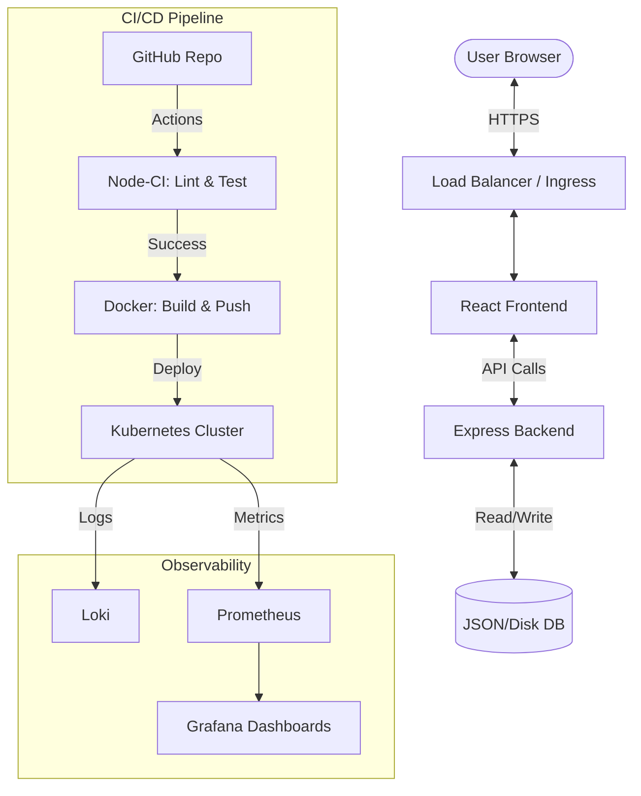

# 🛒 ShopSmart — Full Stack DevOps Project

[](https://github.com/amathziah/devops/actions/workflows/node-ci.yml)
[](https://github.com/amathziah/devops/actions/workflows/docker.yml)
[](https://github.com/amathziah/devops/actions/workflows/terraform.yml)

ShopSmart is a production-ready, full-stack application designed to showcase a modern **DevOps Automation Suite**. It features a high-performance React frontend, a scalable Node.js backend, and a comprehensive infrastructure layer covering CI/CD, Containerization, Orchestration, IaC, and Monitoring.

---

## ✨ Features

- **CRUD Application**: Complete Item management (Create, Read, Update, Delete).
- **Secure Authentication**: JWT-based auth with protected routes and persistent sessions.
- **Automated Testing**: 90%+ branch coverage with Unit, Integration, and Playwright E2E tests.
- **Micro-animations**: Premium UX with glassmorphism and smooth transitions.
- **Infrastructure as Code**: Fully automated environment provisioning via Terraform.
- **Cloud-Native**: Kubernetes-ready manifests with liveness/readiness probes and resource limits.
- **Observability**: Centralized logging and metrics with Prometheus, Grafana, and Loki.

---

## 🏗️ Architecture



---

## 📁 Project Structure

```text
.
├── client/                     # React (Vite) Frontend
│   ├── src/components/         # UI Components & Tests
│   └── src/context/            # Auth & Global State
├── server/                     # Node.js (Express) Backend
│   ├── src/routes/             # API Endpoints
│   └── tests/                  # Integration & Unit Tests
├── e2e/                        # Playwright E2E Test Suite
├── k8s/                        # Production K8s Manifests
├── terraform/                  # Infrastructure as Code
├── monitoring/                 # Prometheus & Grafana Config
└── .github/workflows/          # Automated Pipelines
```

---

## 🛠️ Local Setup

Get the environment up and running in minutes:

```bash
# 1. Clone the repository
git clone https://github.com/amathziah/devops.git && cd devops

# 2. Run the idempotent setup script
chmod +x scripts/setup.sh
./scripts/setup.sh
```

### Manual Controls
- **Start Services**: `docker-compose up -d`
- **Run Frontend**: `cd client && npm run dev`
- **Run Backend**: `cd server && npm start`

---

## 🧪 Testing Strategy

We maintain high quality through a multi-layered testing approach:

- **Unit Tests**: `npm run test:unit` (Isolated logic testing)
- **Integration Tests**: `npm run test:integration` (API & DB interaction)
- **E2E Tests**: `npm run test:e2e` (Full user journey verification)

> Coverage reports are automatically generated and enforced in CI (80% minimum).

---

## ☸️ Kubernetes Deployment

The application is containerized and ready for orchestration:

```bash
kubectl apply -f k8s/
```
Deployments include **Resource Quotas** and **Health Probes** to ensure high availability and stability.

---

## 🌍 Infrastructure as Code (IaC)

Infrastructure is managed via Terraform for consistency across environments:

```bash
cd terraform
terraform init && terraform validate
```

---

## 📊 Monitoring & Observability

Access the real-time health and performance dashboards:

- **Grafana**: `http://localhost:3001` (Default: `admin/admin`)
- **Prometheus**: `http://localhost:9090`
- **Loki**: Log exploration via Grafana "Explore" tab.
---

## 📄 License

This project is built for educational and demonstration purposes.
